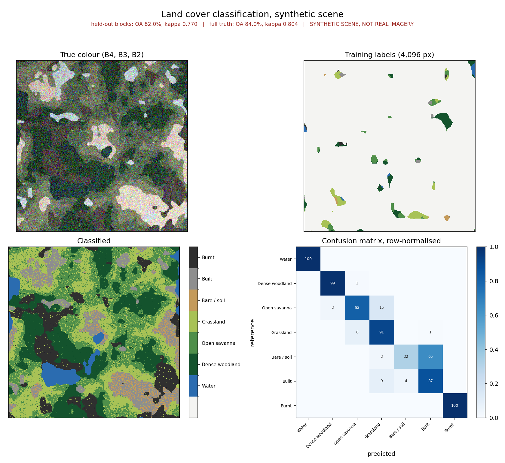

# sentinel2-landcover

Land cover classification from Sentinel-2, supervised with a random forest or
unsupervised with k-means, using a **spatial-block train/test split** and full
per-class accuracy assessment.

CPU only. No GPU, no cloud account, no API key.



> Produced by `s2landcover demo`, which runs on a **synthetic scene, not real
> satellite imagery**. See [Synthetic scenes](#synthetic-scenes).

## The point of this package

Most land cover tutorials split training and test data by **random pixel**.
That is the single most common way a classification accuracy gets overstated.

Neighbouring pixels in satellite imagery are strongly spatially
autocorrelated. Draw a training polygon over a patch of woodland, split its
pixels randomly, and near-duplicates of the same ground end up on both sides of
the split. The model is then scored on pixels it has effectively already seen,
and the number that comes out is not an estimate of how the map performs
anywhere new.

This is why coursework and tutorial classifications routinely report overall
accuracies in the high nineties from a few hand-drawn polygons. It is usually
an artefact of the split, not a good model.

`train_test_split_blocks` assigns whole contiguous blocks of pixels to train or
test, so each patch of ground sits wholly on one side. It is still optimistic,
because blocks from one scene share illumination, season and sensor geometry,
but it is far closer to honest. There is a test that asserts no block is ever
divided.

## Install

```bash
git clone https://github.com/seemonkumawat1234-arch/sentinel2-landcover.git
cd sentinel2-landcover
pip install -e ".[dev]"
```

Four runtime dependencies: `numpy`, `rasterio`, `scikit-learn`, `matplotlib`.

## Use

No data needed:

```bash
s2landcover demo --size 320 --out-dir outputs
s2landcover demo --cluster --clusters 6        # unsupervised instead
s2landcover demo --noise 0.05                  # make the classes harder
```

Real imagery, supervised:

```bash
s2landcover supervised \
  --b2 B02.tif --b3 B03.tif --b4 B04.tif \
  --b8 B08.tif --b11 B11.tif --b12 B12.tif \
  --labels training.tif --block 16 --out-dir outputs
```

Real imagery, unsupervised, no labels required:

```bash
s2landcover cluster --b2 B02.tif ... --clusters 6
```

As a library:

```python
from s2landcover import load_bands, load_labels, run_supervised, plot_result
from s2landcover.scene import LandcoverScene

scene = load_bands({"B2": "B02.tif", "B3": "B03.tif", "B4": "B04.tif",
                    "B8": "B08.tif", "B11": "B11.tif", "B12": "B12.tif"})
labels = load_labels("training.tif", scene.shape)
scene = LandcoverScene(bands=scene.bands, labels=labels, crs=scene.crs,
                       transform=scene.transform,
                       pixel_size_m=scene.pixel_size_m)

result = run_supervised(scene, block=16, out_dir="outputs")
print(result.text_summary())
plot_result(result, scene, "outputs/landcover.png")
```

### Input format

Six bands on a common grid, and for supervised mode a rasterised label image
with class ids 1 and up, 0 for unlabelled:

| Band | Sentinel-2 | Wavelength |
|---|---|---|
| B2 | blue | 490 nm |
| B3 | green | 560 nm |
| B4 | red | 665 nm |
| B8 | NIR | 842 nm |
| B11 | SWIR-1 | 1610 nm |
| B12 | SWIR-2 | 2190 nm |

Bands must already be resampled to one grid. The loader refuses mismatched CRS,
transform or shape rather than resampling silently, because a band resampled
without the caller knowing produces a classification that looks fine and is
wrong along every edge.

## Features

Raw band reflectance plus five spectral indices:

| Index | Separates |
|---|---|
| NDVI | green vegetation from everything else |
| NDWI | open water, which NDVI confuses with deep shadow |
| NDBI | built and bare surfaces, which are SWIR-bright |
| NBR | burnt ground, low NIR and high SWIR-2 |
| BSI | bare soil, which NDBI alone does not separate from built |

The indices are not redundant with the bands they come from. A tree ensemble
splits only on axis-aligned thresholds, so a ratio like NDVI that would need a
diagonal boundary in (NIR, red) space is genuinely new information to it. In
the demo run the five indices carry about 35 percent of total feature
importance, and there is a test asserting they contribute more than a trivial
amount rather than being ignored.

Pass `--no-indices` to use raw bands only and compare.

## Accuracy reporting

Two figures are reported whenever full truth is available:

- **Held-out spatial blocks** of the sparse labels. This is what you can
  actually compute for real data.
- **Full-scene truth**, every pixel's true class. You almost never have this
  outside a simulation.

The gap between them is the useful part. It measures how much hand-drawn
training data flatters a map, because labelled patches sit in the clearest,
most typical parts of each class and skip the ambiguous boundaries where most
error lives. The summary prints the gap and says which direction it points.

Per-class producer's and user's accuracy are always reported, not just overall
accuracy and kappa. Land cover classes are never balanced: a scene that is 60
percent open savanna rewards a classifier for calling everything savanna, and
the minority classes, usually the ones the map was made for, can have near-zero
recall while overall accuracy still looks respectable. There is a test that
builds exactly that case, a 90 percent majority class predicted everywhere, and
asserts overall accuracy is 0.90 while kappa is 0.0.

In the demo run, bare soil comes back with about 32 percent producer's accuracy
against 98 percent user's accuracy. That is not a bug. It is real confusion
with the built class, which is spectrally close, and it is exactly the kind of
failure that a single overall-accuracy number hides.

## Unsupervised mode

`run_unsupervised` fits k-means on a random subsample of pixels and applies it
to all of them, which is what keeps it tractable on a laptop.

It reports **no accuracy figure**, deliberately. Cluster ids are arbitrary, have
no ordering, and are not land cover classes. Turning them into classes needs a
human comparing clusters against imagery, and inventing a score before that
step would be meaningless.

## Tests

```bash
pytest
```

56 tests, no network, no data files. They assert domain behaviour:

- **no block is ever split across train and test**, checked by walking every
  block and asserting it is wholly on one side
- a block larger than the labelled area raises, rather than silently returning
  an empty split
- NDVI is positive for vegetation and negative for water; NDWI's sign is the
  other way round; NBR is negative over char
- a zero denominator returns NaN, not 0, so masked pixels cannot pass as valid
- the feature matrix is row-major, so column 0 reshapes back to the original
  raster exactly
- kappa is 1.0 for perfect agreement and 0.0 for majority-class guessing at 90
  percent overall accuracy
- the confusion matrix is reference-rows by predicted-columns, pinned with an
  asymmetric single-pixel case
- every class in the synthetic scene has more than 10 percent recall, so no
  class silently vanishes from the model
- a validity mask keeps predictions out of masked pixels instead of inventing
  classes there
- the synthetic provenance tag survives a GeoTIFF round trip

## Synthetic scenes

`synthetic_scene()` generates a labelled seven-class scene so the tests and
demo run with no download. Design decisions that make it a real test:

- **Class areas are set by quantiles of each generating field**, so every class
  gets a controlled share of the scene. An earlier version defined the built
  class as the intersection of two independent fields' tails, and its area
  collapsed to a single pixel, which cannot be trained or scored and produced
  NaN accuracy rows.
- **Noise is tuned so the classes genuinely overlap.** The pairs that matter
  are separated by only 0.02 to 0.04 reflectance: open savanna against
  grassland, and bare soil against built. A synthetic scene that classifies at
  99 percent measures nothing.
- **Patch-shaped labels**, not scattered pixels, because that is what
  hand-drawn training polygons look like, and it is what makes a block split
  meaningful.
- **Landscape-scale structure** from multi-octave value noise. With speckle,
  every block would contain every class and the spatial split would prove
  nothing.
- **A broad illumination gradient**, standing in for terrain and view-angle
  effects. Spatially correlated error is what breaks naive classifiers.

The current defaults give about 82 percent overall accuracy on held-out blocks
and 84 percent against full truth, with kappa near 0.78. That is in the range
published Sentinel-2 land cover work reports, which is the target.

Every output is labelled synthetic, including a `SYNTHETIC_INPUT=1` tag in the
GeoTIFF metadata.

**It is not** evidence the method works on real imagery, and the numbers above
describe a random field rather than any real landscape.

## Getting Sentinel-2 data

- **Copernicus Data Space Ecosystem**: https://dataspace.copernicus.eu
- **USGS EarthExplorer**: https://earthexplorer.usgs.gov
- **AWS Open Data**: `s3://sentinel-cogs/`, with the Earth Search STAC API at
  `https://earth-search.aws.element84.com/v1/`, no account needed

Use Level-2A surface reflectance. Resample B11 and B12 from 20 m to 10 m, or
all six bands down to 20 m, before loading. Digitise training polygons in QGIS
or ArcGIS Pro and rasterise them onto the same grid.

## Limitations

- Single-date classification. No time-series features, so classes that are
  separable only by seasonal behaviour, such as cropping versus pasture, will
  not separate well.
- No cloud or shadow masking. Supply cloud-free imagery or mask it first using
  the Sentinel-2 scene classification layer, and pass the mask to
  `predict_raster(valid=...)`.
- No reprojection or resampling.
- Per-pixel classification with no spatial smoothing or segmentation, so the
  output has the salt-and-pepper texture visible in the figure. A majority
  filter or a segment-based approach would clean that up at some cost in
  boundary detail.
- The block split still shares one scene's illumination and phenology across
  train and test. A genuinely independent estimate needs reference data from a
  different scene or a different date.
- Accuracy against sparse hand-drawn labels is an estimate over the labelled
  patches, not over the map. Probability-based reference sampling is the right
  method when the number has to be defensible.

## Licence

MIT. See [LICENSE](LICENSE).
